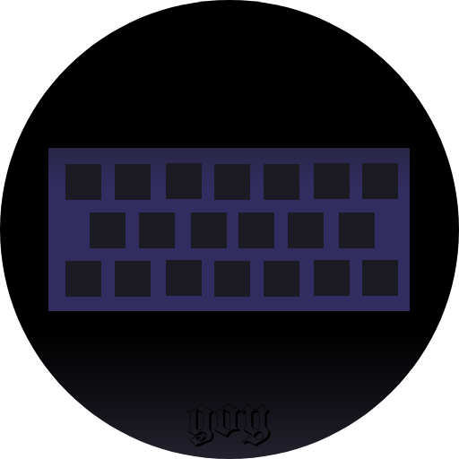

## Goyboard 
Фичи: 
- Родные раскладки: Встроены классические QWERTY и ЙЦУКЕН                           //куда без них 
- Ничего лишнего: работает максимально быстро и имеет базовое управление жестами    //KISS 
- Кастомная раскладка ŭꚏʏќ℮ӊ: для активации два раза нажать на смену раскладки      //самое главное 
- Немного эмоджи: выбор не богат, но самое главное должно быть                      //и каймоджи будут 
- Улучшеный выбор знаков препинания: свайп по кнопке с точкой                       //так удобнее, правда 

Для активации панели с цифрами свайп вправо по кнопке смены
